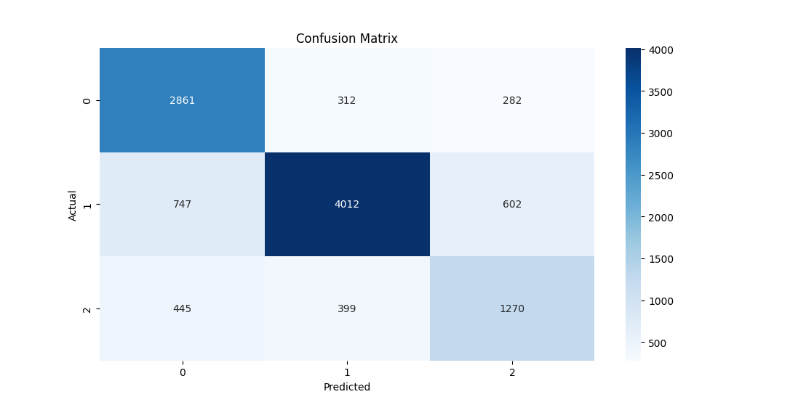
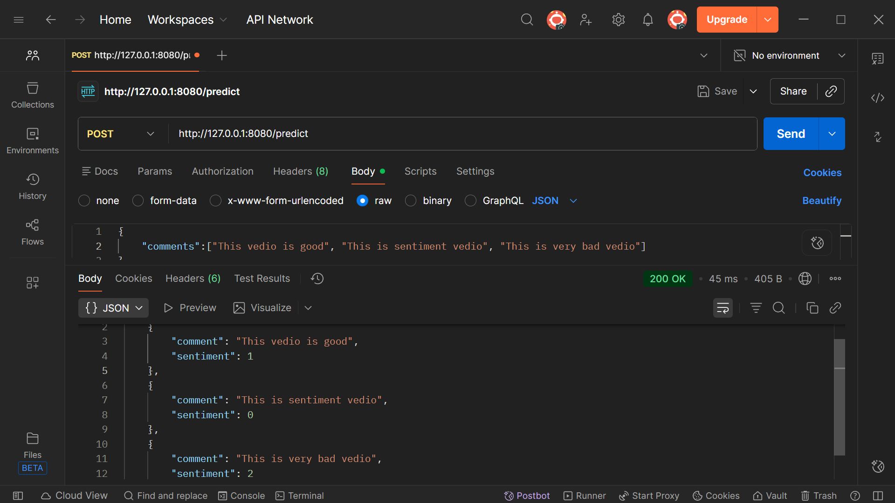

#  YouTube Comment Sentiment Analyzer

> A Chrome extension powered by Machine Learning that analyzes YouTube video comments in real-time using sentiment analysis.

[](https://www.python.org/)
[](https://flask.palletsprojects.com/)
[](https://lightgbm.readthedocs.io/)
[](https://developer.chrome.com/docs/extensions/)

## 📋 Overview

This project combines a Chrome Extension with a Flask-based ML API to provide real-time sentiment analysis of YouTube video comments. It fetches up to 1,000 comments, analyzes their sentiment (Positive/Neutral/Negative), and presents interactive visualizations including pie charts, word clouds, and sentiment trends over time.

## 📸 Demo

### Chrome Extension


### Streamlit App

<video width="320" height="240" controls>
  <source src="demo/video.mp4" type="video/mp4">
</video>

## ✨ Features

- 🔍 **Real-time Analysis** - Fetches and analyzes up to 1,000 comments instantly
- 📊 **Interactive Visualizations** - Pie charts, word clouds, and trend graphs
- 🎯 **High Accuracy** - Machine Learning model with ~75% accuracy
- ⚡ **Fast Processing** - Optimized TF-IDF vectorization with LightGBM
- 📈 **Sentiment Trends** - Track sentiment changes over time
- 💬 **Comment Insights** - Average sentiment score, word count, and unique commenters

## 🛠️ Tech Stack

### Frontend (Chrome Extension)

- **JavaScript (ES6+)** - Core extension logic
- **Chrome Extension API** - Browser integration
- **YouTube Data API v3** - Comment fetching
- **HTML5/CSS3** - Dark-themed UI

### Backend (Flask API)

- **Flask** - RESTful API framework
- **Flask-CORS** - Cross-origin resource sharing
- **Matplotlib** - Chart generation
- **WordCloud** - Text visualization
- **Pandas** - Data manipulation

### Machine Learning

- **LightGBM** - Gradient boosting classifier
- **TF-IDF Vectorization** - Text feature extraction (trigrams, 1000 features)
- **NLTK** - Natural language processing
  - Stopwords filtering
  - WordNet lemmatization
- **Scikit-learn** - Model evaluation and preprocessing

### Model Training Pipeline

- **Optuna** - Hyperparameter optimization
- **Data Sources**: [Reddit](https://raw.githubusercontent.com/Himanshu-1703/reddit-sentiment-analysis/refs/heads/main/data/reddit.csv) + [YouTube Comments datasets](https://www.kaggle.com/datasets/atifaliak/youtube-comments-dataset)
- **Preprocessing**: Cleaning, lemmatization, TF-IDF vectorization
- **Evaluation**: Confusion matrix, classification reports

## 🏗️ Architecture

```
┌─────────────────────────────────────────────────────────────┐
│                     Chrome Extension                        │
│  ┌─────────────┐   ┌─────────────┐   ┌─────────────┐      │
│  │  popup.js   │──▶│  popup.html │──▶│ YouTube API │      │
│  └─────────────┘   └─────────────┘   └─────────────┘      │
└────────────────────────────┬────────────────────────────────┘
                             │ HTTP POST
                             ▼
┌─────────────────────────────────────────────────────────────┐
│                       Flask API Server                      │
│  ┌──────────────────────────────────────────────────────┐  │
│  │  /predict_with_timestamps                            │  │
│  │  - Preprocess comments (NLTK)                        │  │
│  │  - TF-IDF Vectorization (1000 features, trigrams)   │  │
│  │  - LightGBM Prediction                               │  │
│  │  - Reverse mapping [2,0,1] → [-1,0,1]               │  │
│  └──────────────────────────────────────────────────────┘  │
│  ┌──────────────────────────────────────────────────────┐  │
│  │  /generate_chart - Matplotlib pie chart             │  │
│  │  /generate_wordcloud - WordCloud visualization      │  │
│  │  /generate_trend_graph - Time-series sentiment      │  │
│  └──────────────────────────────────────────────────────┘  │
└─────────────────────────────────────────────────────────────┘
                             │
                             ▼
┌─────────────────────────────────────────────────────────────┐
│                    ML Model (artifacts/)                    │
│  - lightgbm_model.pkl (trained model)                       │
│  - tfidf_vectorizer.pkl (fitted vectorizer)                 │
└─────────────────────────────────────────────────────────────┘
```

## 📊 Model Performance

The LightGBM model was trained on a combined dataset from Reddit, YouTube, and Twitter:

| Metric                   | Score |
| ------------------------ | ----- |
| **Accuracy**             | ~75%  |
| **Precision (Neutral)**  | 0.83  |
| **Precision (Positive)** | 0.75  |
| **Precision (Negative)** | 0.60  |

**Confusion Matrix:**



### Model Details

- **Algorithm**: LightGBM Classifier
- **Features**: TF-IDF (1000 features, trigrams)
- **Classes**: 3 (Negative, Neutral, Positive)
- **Hyperparameters**: Optimized with Optuna (100 trials)
- **Training Data**: ~45,500 labeled comments

## 🚀 Installation & Setup

### Prerequisites

- Python 3.8+
- Chrome Browser
- YouTube Data API Key ([Get one here](https://console.cloud.google.com/))

### Backend Setup

1. **Clone the repository**

```bash
git clone https://github.com/RedDragon30/YouTube-Viewer-Sentiment-Analysis-System.git
cd YouTube-Viewer-Sentiment-Analysis-System
```

2. **Run Setup file**

**Windows**

```bash
# Setup
.\setup.bat
```

**Linux**

```bash
# Grant execution permissions
chmod +x setup.sh

# Setup
./setup.sh
```

4. **Download NLTK data**

```bash
python -c "import nltk; nltk.download('stopwords'); nltk.download('wordnet')"
```

5. **Run the python file to get pickle files**

```bash
python main.py
```

6. **Run the Flask server**

```bash
python app.py
```

Server will start at `http://localhost:8080`

### Chrome Extension Setup

1. **Add your YouTube API Key**

   - Open `popup.js`
   - Replace `API_KEY` with your actual key (Line 4)

2. **Load extension in Chrome**

   - Open Chrome and go to `chrome://extensions/`
   - Enable "Developer mode"
   - Click "Load unpacked"
   - Select the extension folder

3. **Test the extension**
   - Navigate to any YouTube video
   - Click the extension icon
   - Wait for analysis results

## 📁 Project Structure

```
youtube-sentiment-analyzer/
├── artifacts/
│   ├── lightgbm_model.pkl     # Trained model
│   └── tfidf_vectorizer.pkl   # Fitted vectorizer
├── chrome-plugin/
│   ├── manifest.json          # Extension configuration
│   ├── popup.html             # Extension UI
│   └── popup.js               # Extension logic
├── src/
│   ├── data_ingestion.py      # Data loading (ZIP/CSV)
│   ├── data_preprocessing.py  # Cleaning & vectorization
│   ├── data_splitting.py      # Train/test split
│   ├── models_training.py     # Model training & optimization
│   └── models_evaluation.py   # Performance metrics
├── app.py                     # Flask API server
├── main.py                    # Training pipeline
├── requirements.txt           # Python dependencies
├── .gitignore                 # Git ignore rules
└── README.md                  # This file
```

## 🔌 API Endpoints



### POST `/predict_with_timestamps`

Analyze comments with timestamps

**Request:**

```json
{
  "comments": [
    {
      "text": "Great video!",
      "timestamp": "2024-01-15T10:30:00Z",
      "authorId": "UC..."
    }
  ]
}
```

**Response:**

```json
[
  {
    "comment": "Great video!",
    "sentiment": "1",
    "timestamp": "2024-01-15T10:30:00Z"
  }
]
```

### POST `/generate_chart`

Generate sentiment distribution pie chart

**Request:**

```json
{
  "sentiment_counts": {
    "1": 450,
    "0": 300,
    "-1": 250
  }
}
```

**Response:** PNG image (pie chart)

### POST `/generate_wordcloud`

Generate word cloud from comments

**Request:**

```json
{
  "comments": ["comment 1", "comment 2", ...]
}
```

**Response:** PNG image (word cloud)

### POST `/generate_trend_graph`

Generate sentiment trend over time

**Request:**

```json
{
  "sentiment_data": [
    {"timestamp": "2024-01-15T10:30:00Z", "sentiment": 1},
    ...
  ]
}
```

**Response:** PNG image (line graph)

## 📝 License

This project is open source and available under the [MIT License](LICENSE).

## 🙏 Acknowledgments

- **Datasets**: Reddit, YouTube Comments datasets
- **Libraries**: LightGBM, Flask, NLTK, Matplotlib, WordCloud
- **Inspiration**: YouTube comment toxicity research

## 📧 Contact

**Your Name** - [email](mailto:emranalbiek@gmail.com)

Project Link: [github](https://github.com/RedDragon30/YouTube-Viewer-Sentiment-Analysis-System)

---

⭐ If you found this project helpful, please give it a star!
